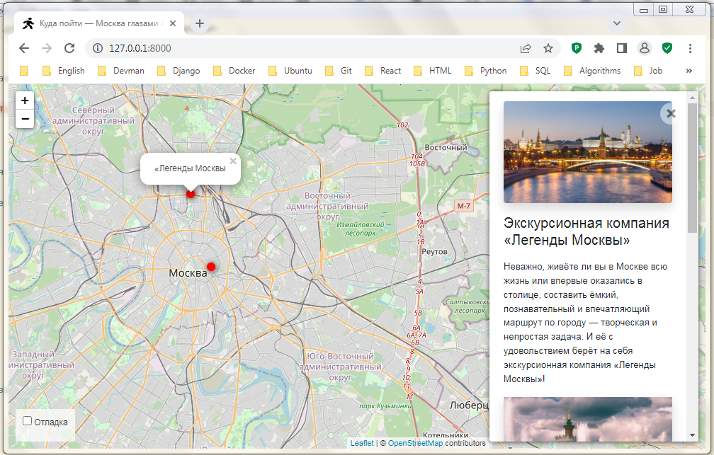
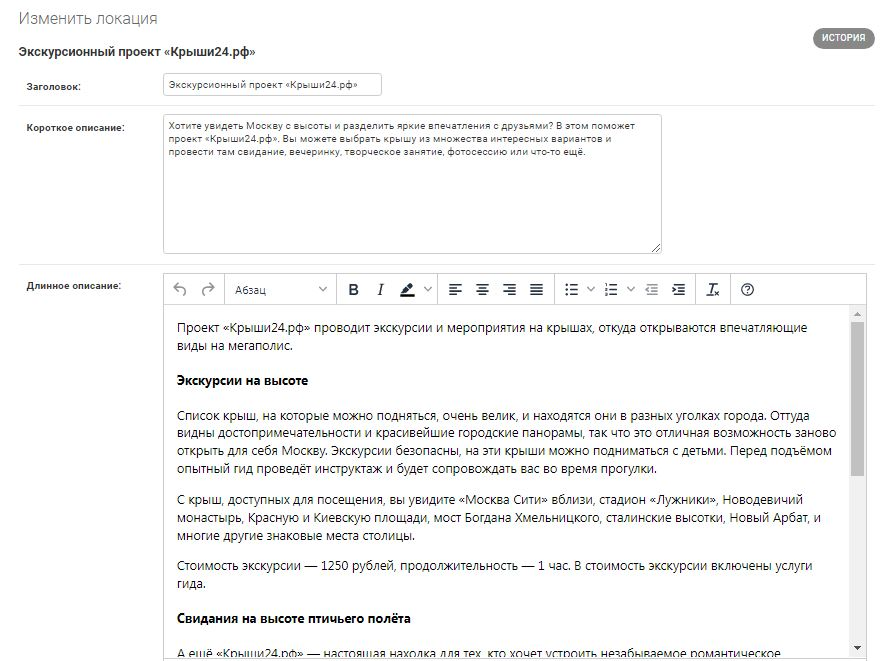
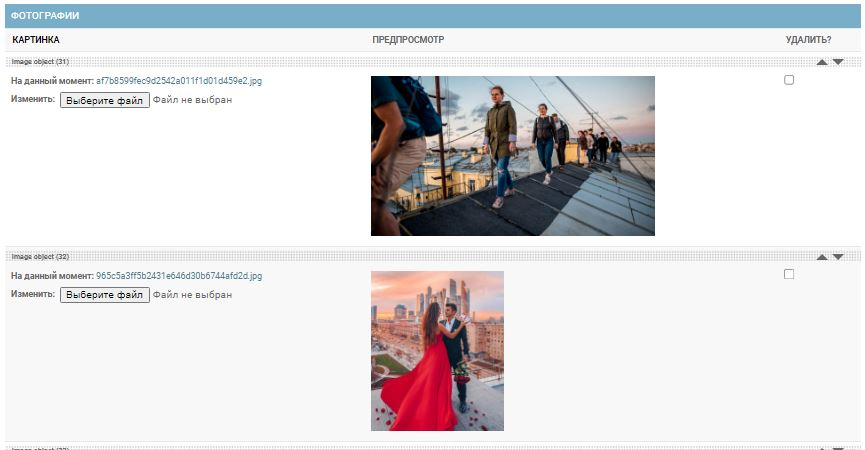

# Куда пойти в Москве - Советы Артёма

Проект представляет собой [сайт](https://artiomkudago.pythonanywhere.com/) с интерактивной картой интересных мест Москвы от блогера Артёма.



## Описание

На этом сайте представлена интерактивная Яндекс-карта, на которой вы можете легко найти интересные места в Москве. Эти места отмечены на карте точками, при клике на каждую из которых можно увидеть информацию о соответствующем месте и его фотографии на панели справа от карты. 

На сайте представлены места, которые советует посетить блогер Артём. Но вы легко можете развернуть такой же сайт со своими собственными советами. Как это сделать, будет описано ниже. В этом случае интересные места, их описания и фотографии очень удобно добавлять через [административную панель](https://artiomkudago.pythonanywhere.com/admin/places/place/) сайта:



Как видно на картинке выше, админка оснащена удобным [текстовым редактором](https://github.com/jazzband/django-tinymce), позволяющим легко вводить описание с нужным форматироварованием и гиперссылками.

Кроме этого, в админке легко прикреплять фотографии для каждого интересного места:



В админке этим фотографиям можно задать порядок следования простым их перетаскиванием. Заданный в админке порядок фотографий будет после этого поддерживаться и в информационной панели на сайте.

## Как запустить

Для запуска сайта вам понадобится Python версии 3.8.

Скачайте код с GitHub. Создайте виртуальное окружение и активируйте его:
```
python -m venv venv
venv/Scripts/activate
```

Установите зависимости:

```sh
pip install -r requirements.txt
```

Создайте базу данных:

```sh
python manage.py migrate
python manage.py createsuperuser
```

Перейдите в папку where_to_go и запустите разработческий сервер:

```
python manage.py runserver
```

## Переменные окружения

Часть настроек проекта берётся из переменных окружения. Чтобы их определить, создайте файл `.env` рядом с `manage.py` и запишите туда данные в таком формате: `ПЕРЕМЕННАЯ=значение`.

Доступно 5 переменных:
- `DEBUG` — дебаг-режим (поставьте `True`, чтобы увидеть отладочную информацию в случае ошибки).
- `SECRET_KEY` — секретный ключ проекта.
- `DATABASE_ENGINE` — движок базы данных, например: `django.db.backends.sqlite3`.
- `DATABASE_NAME` — имя базы данных, например: `places.sqlite3`.
- `ALLOWED_HOSTS` — см. [документацию Django](https://docs.djangoproject.com/en/3.1/ref/settings/#allowed-hosts).

## Загрузка в базу данных из json-файлов

Для загрузки данных из json-файлов выполните следующую команду:
```
python manage.py load_place <список_url_json_файлов>
```
где `<список_url_json_файлов>` нужно заменить на список url json-файлов, разделённых пробелами. Например:
```
python manage.py load_place https://some.website.com/example1.json https://some.website.com/example2.json
```
Пример json-файла вы можете найти в папке `examples/`

## Источники

Frontend для сайта взят [отсюда](https://github.com/devmanorg/where-to-go-frontend/). 

Тестовые данные можно найти на [Kudago](https://kudago.com/msk/).

## Цели проекта

Код написан в учебных целях — для курса по Python и backend-разработке на сайте [Devman](https://dvmn.org). 
